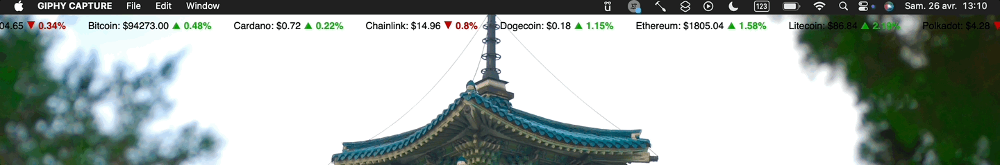

# Übersicht Crypto Widget

A minimalist and real-time crypto price widget for [Übersicht](https://tracesof.net/uebersicht/), designed to display the latest market data directly on your macOS desktop.

## ✨ Features

- Live prices for cryptocurrencies (Bitcoin, Ethereum, etc.)
- Clean, lightweight and non-intrusive design
- Fully customizable: colors, layout, currencies displayed
- Works out-of-the-box with free APIs like [CoinGecko](https://www.coingecko.com/) or [CoinMarketCap](https://coinmarketcap.com/)

## 🖼️ Preview



_Minimal setup — clean information directly on your desktop._

## 🚀 Getting Started

1. Install [Übersicht](https://tracesof.net/uebersicht/).
2. Download or clone this repository into your Übersicht widgets folder:
   ```bash
   git clone https://github.com/your-username/ubersicht-widget-crypto.git
   ```
